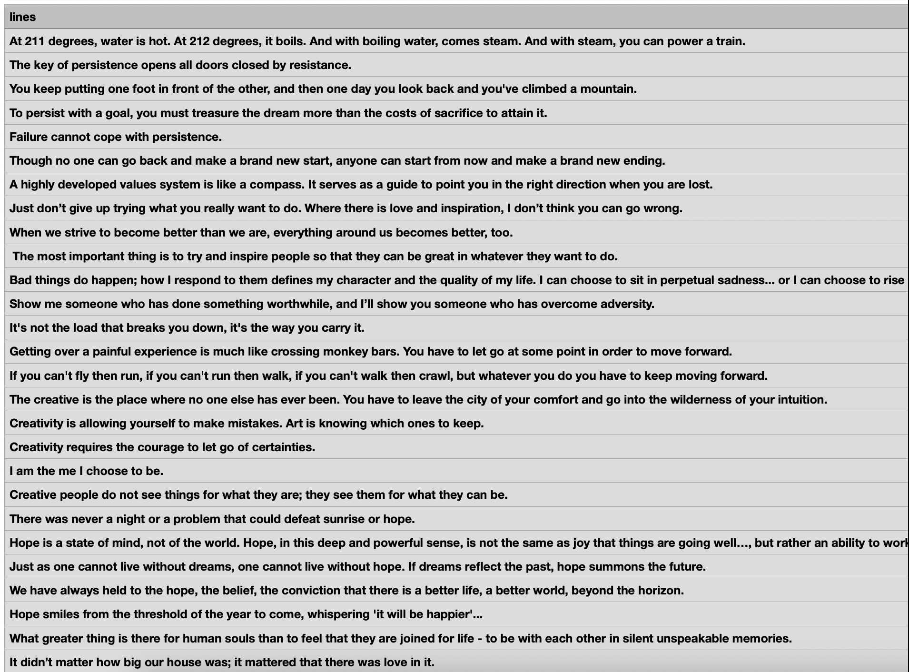

# <p align="center"> UAS Pemrograman


<br>

# Penjelasan

<p align="justify">Import Libary

- Import Request untuk mengambil data request html.

```sh
import requests
```

- from bs4 import BeautifulSoup untuk Scraping Data.

```sh
from bs4 import BeautifulSoup
```

- Import CSV untuk membuat file csv, penampung data scraping.

```sh
import csv
```

<p align="justify">Mengambil Data dari URL

```sh
URL = "https://www.goodreads.com/quotes"
resp = requests.get(URL)
```

<p align="justify">Mencari dan Append Data

```sh
for row in table.findAll('div', attrs = {'class':'quoteDetails'}):
    quote = {}
    quote['image'] = row.a['href']
    quotes.append(quote)
```

<p align="justify">Membuat file CSV dan menulis data.

```sh
filename = 'quote.csv'
with open(filename, 'w') as f:
    w = csv.DictWriter(f,['image'])
    w.writeheader()
    for quote in quotes:
        w.writerow(quote)
```

---

# Hasil Output


